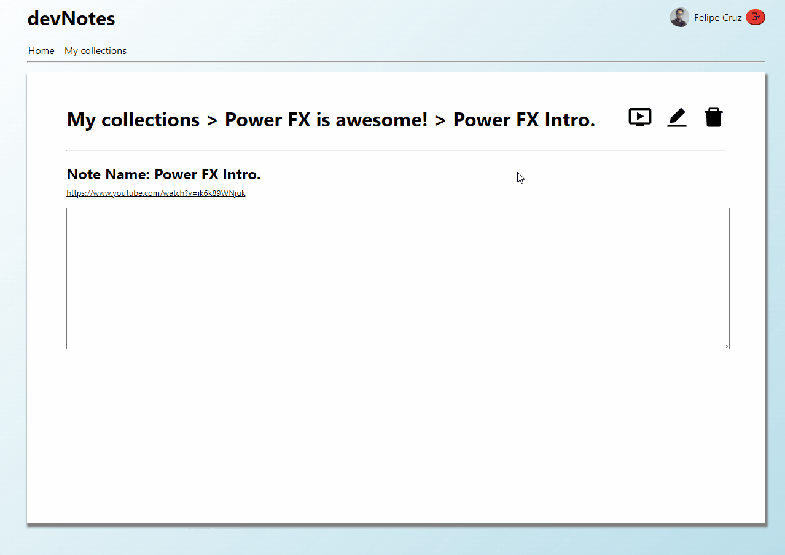

# devNotes

## A React-Firebase application to help self taught devs to organize notes from youtube.



This project was build with the intention of being a demonstration of the technologies of typescript and react. It was built within my company's Individual Development Program (IDP) and is intended to serve as practice in developing with these technologies. The application aims to serve as a notepad for youtube videos. Making you, self-taught developer, have a single place to save notes from video tutorials, courses etc.

### Live application here: [Click me!](https://devnotes-b1a97.web.app/)

<hr/>

## :ok_hand: - Features (so far)

- Authentication
- CRUD in real time
- Video embeded to notes

<hr/>

## :joystick: - Run in my pc

To run the application in your PC, just clone the repo and do:

```
npm install
```

Then edit the firebaseConfig const inside Auth.tsx:

```
const firebaseConfig = {
   apiKey: <YOUR_API_KEY>,

   authDomain: <YOUR_AUTH_DOMAIN>,

   projectId: <YOUR_PROJECT_ID>,

   storageBucket: <YOUR_STORAGE_BUCKET>,

   messagingSenderId: <YOUR_MESSAGINGSENDERID>,

   appId: <YOUR_APP_ID>,

   measurementId: <YOUR_MEASUREMENT_ID>,
 };
```

Then:

```
npm start
```
